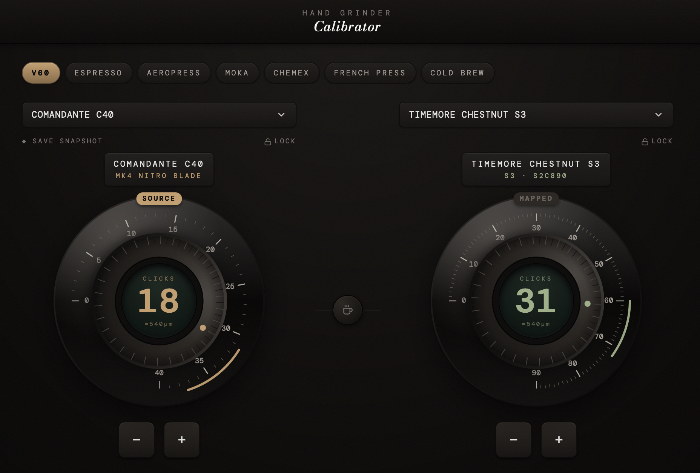

# Coffee Grinder Calibrator

A browser-based tool for specialty coffee grinders with two modes:

- **Calibrator** — translate a grind setting from one hand grinder to another. Dial in a click count and see the equivalent on any other supported grinder, based on each grinder's µm/click and zero-offset. Includes brew method presets (V60, Espresso, AeroPress, Moka, Chemex, French Press, Cold Brew) with highlighted recommended ranges and haptic-style click feedback.
- **Dialer (beta)** — get a starting grind range for a new bean. Select the processing type, roast profile, and altitude; pick your grinder; and get a recommended click range and brew temperature.

**[Use it here](https://grindsize.in/)**

## Supported grinders

| Grinder | Notes | Research |
|---|---|---|
| Comandante C40 MK4 Nitro Blade | 30 µm/click, 0–40 clicks | [Research](grinder-research/c40-s3.md) |
| Timemore Chestnut S3 | 15 µm/click, 0.075 mm factory zero offset, 0–90 clicks | [Research](grinder-research/c40-s3.md) |
| Timemore Chestnut C2 | 35 µm/click (back-fit from HCG community ranges), 0–36 clicks | [Research](grinder-research/c2.md) |
| Timemore Chestnut C3 / C3S | 41 µm/click (back-fit from HCG; manufacturer cites ~83), 0–25 clicks, S2C660 burrs | [Research](grinder-research/c3.md) |
| 1Zpresso ZP6 Special | 22 µm/click, 0–90 clicks, pour-over only (no espresso) | [Research](grinder-research/zp6.md) |
| 1Zpresso K-Ultra | 7.6 µm/click (back-fit from HCG; manufacturer cites 20), ~40 µm factory zero offset, 0–100 clicks | [Research](grinder-research/k-ultra.md) |
| KINGrinder K6 | 8.5 µm/click (back-fit from HCG; manufacturer cites 16), ~40 µm factory zero offset, 0–180 clicks, R.CC dial notation | [Research](grinder-research/k6.md) |
| 1Zpresso Q Air | 12.5 µm/click (back-fit from HCG; manufacturer cites 25), 0–120 clicks, R.N.C dial notation | [Research](grinder-research/q-air.md) |
| MHW-3BOMBER Blade R3 | 5.6 µm/click (back-fit from HCG; manufacturer cites 16 µm burr travel), 165 µm factory zero offset, 0–180 clicks, R.N.T dial notation | [Research](grinder-research/mhw-blade-r3.md) |
| Baratza Encore | 26 µm/click + 270 µm zero offset (back-fit from HCG), 0–40 settings, 40 mm M3 conical; electric, not ESP | [Research](grinder-research/baratza-encore.md) |
| Fiorenzato Pietro B-Modal | 7.5 µm/click + 170 µm zero offset (back-fit from HCG; manufacturer cites 15), 0–100 clicks, 58 mm vertical flat MultiPurpose burrs, N.C dial notation | [Research](grinder-research/pietro-b-modal.md) |
| Fiorenzato Pietro M-Modal | 7.5 µm/click + 230 µm zero offset (back-fit from HCG; manufacturer cites 15), 0–100 clicks, 58 mm vertical flat ProBrewing burrs, N.C dial notation | [Research](grinder-research/pietro-m-modal.md) |

## How the mapping works

Microns are the single source of truth. Each brew method has a recommended micron range, and every grinder's click range is derived from that range using its own µm-per-click and zero-offset values. Setting one grinder updates the other to the equivalent grind size in microns.

## Brew-method ranges source

Recommended ranges are based on the [Honest Coffee Guide](https://honestcoffeeguide.com/) charts for each grinder, expressed in microns so they apply consistently across grinders.

## Open questions

Issues where real-world feedback conflicts with our HCG-sourced data. Needs more evidence before changing the config.

| Grinder | Question |
|---|---|
| 1Zpresso Q Air / Q2 | **V60 range may start too fine.** HCG puts V60 at 1.2.0–2.0.1 (36–61 clicks). The 1Zpresso manufacturer chart puts Pour Over at 1.8.0–2.4.0 (54–72 clicks), with 1.2.0–1.8.0 labelled as AeroPress/Moka/Drip territory. A user grinding for pour-over found our start point too fine. Need more Q Air / Q2 user data to decide whether to adopt `methodOverrides` for V60. |

## License

MIT License

Copyright (c) 2026

Permission is hereby granted, free of charge, to any person obtaining a copy of this software and associated documentation files (the "Software"), to deal in the Software without restriction, including without limitation the rights to use, copy, modify, merge, publish, distribute, sublicense, and/or sell copies of the Software, and to permit persons to whom the Software is furnished to do so, subject to the following conditions:

The above copyright notice and this permission notice shall be included in all copies or substantial portions of the Software.

THE SOFTWARE IS PROVIDED "AS IS", WITHOUT WARRANTY OF ANY KIND, EXPRESS OR IMPLIED, INCLUDING BUT NOT LIMITED TO THE WARRANTIES OF MERCHANTABILITY, FITNESS FOR A PARTICULAR PURPOSE AND NONINFRINGEMENT. IN NO EVENT SHALL THE AUTHORS OR COPYRIGHT HOLDERS BE LIABLE FOR ANY CLAIM, DAMAGES OR OTHER LIABILITY, WHETHER IN AN ACTION OF CONTRACT, TORT OR OTHERWISE, ARISING FROM, OUT OF OR IN CONNECTION WITH THE SOFTWARE OR THE USE OR OTHER DEALINGS IN THE SOFTWARE.
